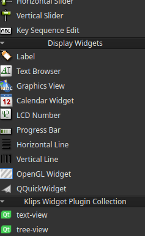

# Cpp

```bash
shaunrd0/klips/cpp/qt/
├── designer                    # Using Qt Designer to create application GUI
├── designer-plugin             # Adding custom widgets as Qt Designer plugins
├── designer-plugin-collection  # Adding a collection of widget plugins to Qt Designer
└── README.md
```

This directory contains a `CMakeLists.txt`, which can be selected to open as a 
project within your preferred IDE. From there, all nested examples can be built,
debugged, and ran.

The plugin examples will need to be installed for Qt Designer integration to work.
On Linux, Qt Designer looks under `/some/path/to/Qt/Tools/QtCreator/lib/Qt/plugins/designer/`.
On windows or Mac, this path may differ. Unfortunately I don't have these machines to test for myself.

```bash
cd klips/cpp/qt/designer-plugin-collection
mkdir build && cd build
cmake .. && cmake --build . --target install
```

After installing the plugin collection example above, we can open Qt Creator and navigate to the Designer.
We should see the custom collection is available within the Designer, and the contents of the widgets render correctly in the application view.





