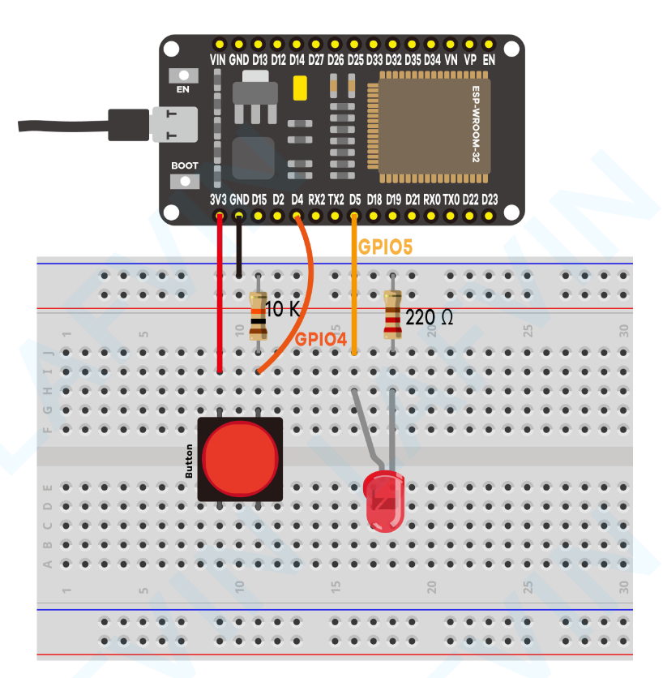
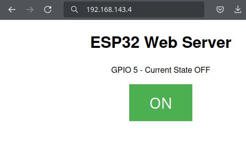

# 02_led-button-web

This example is largely adapted from those in [ESP32-basic-starter-kit.pdf](./ESP32-basic-starter-kit.pdf).

The APIs in the original examples paired with this PDF have changed, and I decided to do some different things with the code and/or circuits, but the original code can be [found here](https://www.dropbox.com/scl/fo/6znlij3eb23ih4jxcpv2w/AKvB1t9CCUgoVRVtGen8Yrw?rlkey=z84anl0hs940qf9fpl7l8q8q2&e=1&dl=0).

This example uses the same schematic as [01_led-button](../01_led-button/).

The only difference is that you can also control the button through a web browser from any device connected to your local network.

This example was adapted from the example code in the [Arduino ESP32 API reference](https://docs.espressif.com/projects/arduino-esp32/en/latest/api/wifi.html#wi-fi-ap-example).

