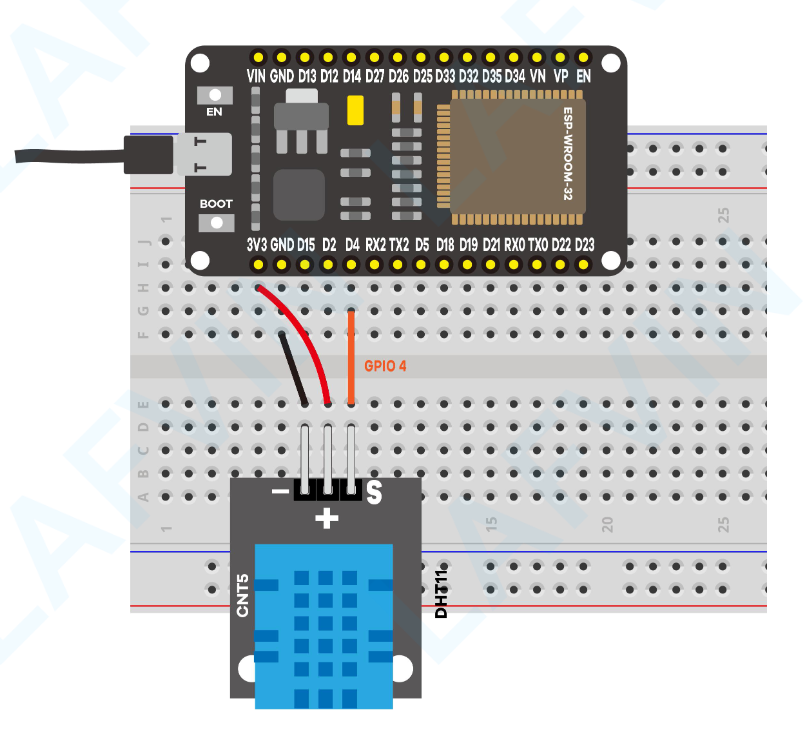
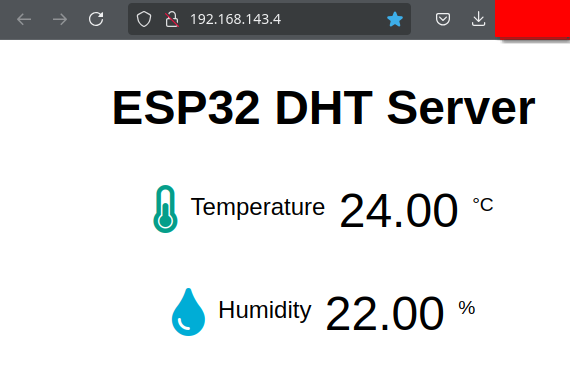

# 03_temp-humidity-web

This example is largely adapted from those in [ESP32-basic-starter-kit.pdf](./ESP32-basic-starter-kit.pdf).

The APIs in the original examples paired with this PDF have changed, and I decided to do some different things with the code and/or circuits, but the original code can be [found here](https://www.dropbox.com/scl/fo/6znlij3eb23ih4jxcpv2w/AKvB1t9CCUgoVRVtGen8Yrw?rlkey=z84anl0hs940qf9fpl7l8q8q2&e=1&dl=0).



Temperature and humidity sensor served on a web page within the local network.



## Dependencies

You need to install a couple of libraries for this project:

* The DHT and the Adafruit Unified Sensor Driver libraries to read from the DHT sensor.
* ESPAsyncWebServer and Async TCP libraries to build the asynchronous web server.

The default Arduino IDE installation will store libraries at `~/Arduino/ibraries` - if this directory doesn't exist, create it.

### Installing DHT Sensor Library

To read from the DHT sensor using Arduino IDE, you need to install the [DHT sensor library](https://github.com/adafruit/DHT-sensor-library).

```bash
wget -O DHT_sensor.zip https://github.com/adafruit/DHT-sensor-library/archive/master.zip
unzip DHT_sensor.zip
mv DHT-sensor-library-master/ ~/Arduino/libraries/DHT_sensor
```

## Install Adafruit Unified Sensor Driver Library

You also need to install the [Adafruit Unified Sensor Driver library](https://github.com/adafruit/Adafruit_Sensor) to work with the DHT sensor.

```bash
wget -O Adafruit_sensor.zip https://github.com/adafruit/Adafruit_Sensor/archive/master.zip
unzip Adafruit_sensor.zip
mv Adafruit_Sensor-master/ ~/Arduino/libraries/Adafruit_sensor
```

## Installing ESPAsyncWebServer Library

Follow the next steps to install the [ESPAsyncWebServer library](https://github.com/me-no-dev/ESPAsyncWebServer):

```bash
wget -O ESPAsyncWebServer.zip https://github.com/me-no-dev/ESPAsyncWebServer/archive/master.zip
unzip ESPAsyncWebServer.zip
mv ESPAsyncWebServer-master/ ~/Arduino/libraries/ESPAsyncWebServer
```

## Installing Async TCP Library

The ESPAsyncWebServer library requires the [AsyncTCP library](https://github.com/me-no-dev/AsyncTCP) to work. Follow the next steps to install that library:

```bash
wget -O AsyncTCP.zip https://github.com/me-no-dev/AsyncTCP/archive/master.zip
unzip AsyncTCP.zip
mv AsyncTCP-master/ ~/Arduino/libraries/AsyncTCP
```
