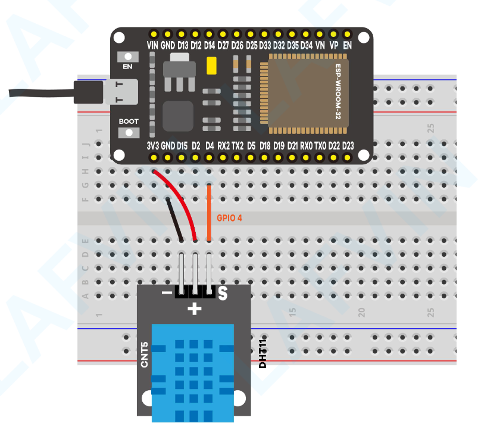
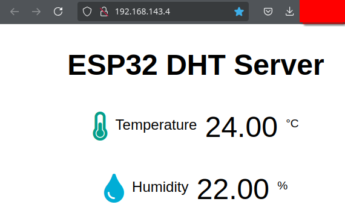

# 05_temp-humidity-web

This is the same example in [03_temp-humidity-web](./../03_temp-humidity-web), ported to the cmake ESP-IDF build system.

For instructions on setting up the ESP-IDF see [04_-esp-idf-arduino](./../04_esp-idf-arduino)

This example is largely adapted from those in [ESP32-basic-starter-kit.pdf](./ESP32-basic-starter-kit.pdf).

The APIs in the original examples paired with this PDF have changed, and I decided to do some different things with the code and/or circuits, but the original code can be [found here](https://www.dropbox.com/scl/fo/6znlij3eb23ih4jxcpv2w/AKvB1t9CCUgoVRVtGen8Yrw?rlkey=z84anl0hs940qf9fpl7l8q8q2&e=1&dl=0).



Temperature and humidity sensor served on a web page within the local network.



To build this example run the following commands.

```bash
source ~/path/to/esp-idf/export.sh

mkdir build
cd build
cmake ..
make -j $(nproc)
make flash
```
