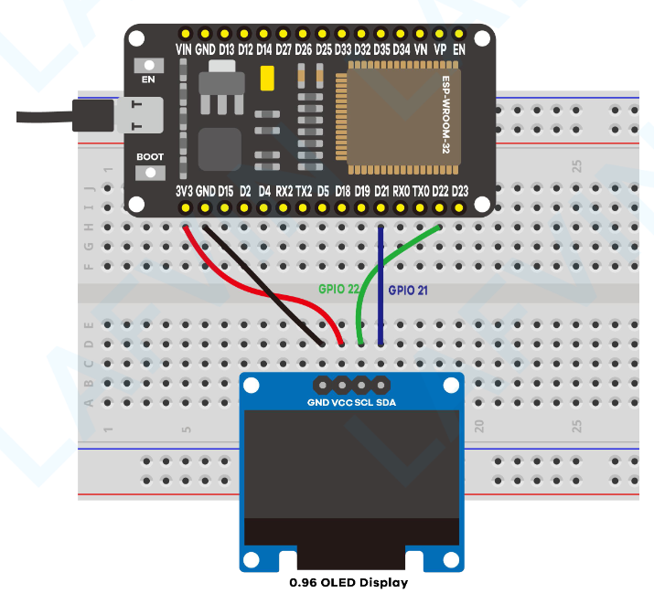

# 06_i2c-scanner



Simple I2C device scanner.

For this example I used this [SSD1306 OLED display](https://www.digikey.com/en/products/detail/winstar-display/WEA012864DWPP3N00003/20533255).

To build the example run the following commands.

```bash
source ~/path/to/esp-idf/export.sh

mkdir build
cd build
cmake ..
make -j $(nproc)

# Flash to ESP32
make flash

# Open Serial Monitor, press CTRL+] to exit.
make monitor
```

Expected output in serial monitor at 115200 baud

```bash
Scanning I2C devices...
[0x3c]: Device found with clock rate 100000 and timeout 50
Done.
```
