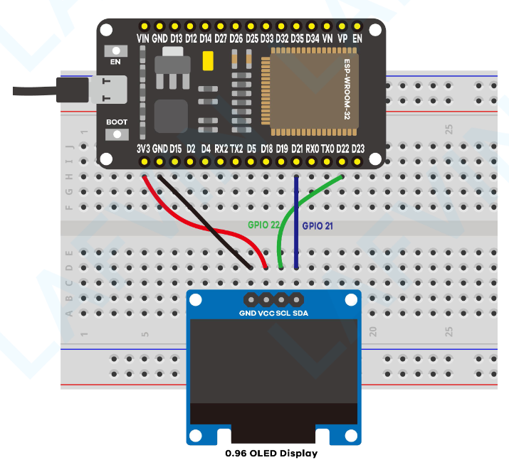
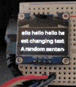

# 07_lcd-panel-i2c

Using the ESP IDF for drawing to a LCD screen over I2C.

[ESP IDF - I2C](https://docs.espressif.com/projects/esp-idf/en/v5.3.2/esp32/api-reference/peripherals/i2c.html)

[ESP IDF - LCD](https://docs.espressif.com/projects/esp-idf/en/v5.3.2/esp32/api-reference/peripherals/lcd/index.html)

[ESP IDF - FreeRTOS](https://docs.espressif.com/projects/esp-idf/en/v5.3.2/esp32/api-reference/system/freertos.html)





For instructions on setting up the ESP-IDF see [04_-esp-idf-arduino](./../04_esp-idf-arduino)

To build this example run the following commands.

```bash
source ~/path/to/esp-idf/export.sh

mkdir build
cd build
cmake ..
make -j $(nproc)
make flash
```
