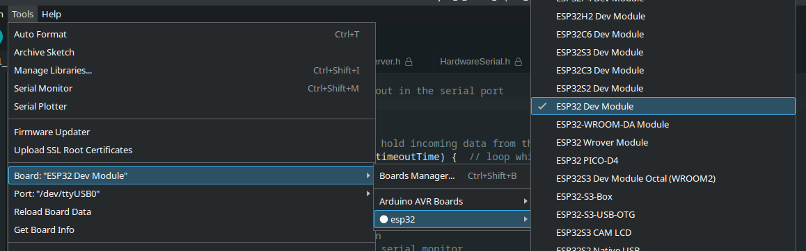

# esp

```bash
shaunrd0/klips/esp/
├── 01_led-button               # Simple LED circuit controlled by an on board button.
├── 02_led-button-web           # LED controlled by a button or within a web browser.
├── ESP32-basic-starter-kit.pdf # PDF for tutorials in ESP32 starter kit.
├── ESP32-dev-module.png
└── README.md
```

This directory contains ESP32 projects largely adapted from the examples in [ESP32-basic-starter-kit.pdf](./ESP32-basic-starter-kit.pdf).

The APIs in the original examples paired with this PDF have changed, and I decided to do some different things with the code and/or circuits, but the original code can be [found here](https://www.dropbox.com/scl/fo/6znlij3eb23ih4jxcpv2w/AKvB1t9CCUgoVRVtGen8Yrw?rlkey=z84anl0hs940qf9fpl7l8q8q2&e=1&dl=0).

The board selected in [Arduino IDE](https://www.arduino.cc/en/software) is ESP32 Dev Module -



[Arduino ESP32 GitHub](https://github.com/espressif/arduino-esp32) \
[Arduino ESP32 API reference](https://docs.espressif.com/projects/arduino-esp32/en/latest/libraries.html)