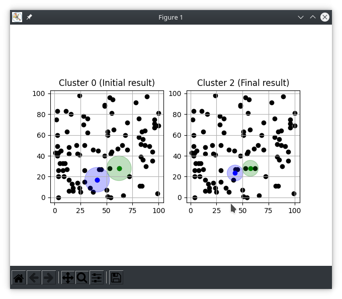

Install required dependencies for matplotlib GUI frontend and all pip other packages for this project

```bash
sudo apt install python3-tk
python3.9 -m pip install -r requirements.txt
```

CLI to run K-Means clustering algorithm on a set of data.
Data can be provided or randomly generated for testing.

```bash
python3.9 k-means.py -h
usage: k-means.py [-h] [--data [X,Y ...]] [--seeds [X,Y ...]] [--silent] [--verbose] [--random] [--radius [RADIUS]]
                [--lock-radius] [--file [FILE_PATH]]
                [CLUSTER_COUNT] [CENTROID_SHIFT] [LOOP_COUNT]

K-means clustering program for clustering data read from a file, terminal, or randomly generated

positional arguments:
  CLUSTER_COUNT         Total number of desired clusters
                            (default: '2')
                                
  CENTROID_SHIFT        Centroid shift threshold. If cluster centroids move less-than this value, clustering is finished
                            (default: '1.0')
                                
  LOOP_COUNT            Maximum count of loops to perform clustering
                            (default: '3')
                                

optional arguments:
  -h, --help            show this help message and exit
  --data [X,Y ...], -d [X,Y ...]
                        A list of data points separated by spaces as: x,y x,y x,y ...
                            (default: '[(1.0, 2.0), (2.0, 3.0), (2.0, 2.0), (5.0, 6.0), (6.0, 7.0), (6.0, 8.0), (7.0, 11.0), (1.0, 1.0)]')
                                
  --seeds [X,Y ...], --seed [X,Y ...], -s [X,Y ...]
                        A list of seed points separated by spaces as: x,y x,y x,y ...
                            Number of seeds provided must match CLUSTER_COUNT, or else CLUSTER_COUNT will be overriden.
                                
  --silent              When this flag is set, scatter plot visualizations will not be shown
                            (default: 'False')
                                
  --verbose, -v         When this flag is set, cluster members will be shown in output
                            (default: 'False')
                                
  --random, -r          When this flag is set, data will be randomly generated
                            (default: 'False')
                                
  --radius [RADIUS]     Initial radius to use for clusters
                            (default: 'None')
                                
  --lock-radius, -l     When this flag is set, centroid radius will not be recalculated
                            (default: 'False')
                                
  --file [FILE_PATH], -f [FILE_PATH]
                        Optionally provide file for data to be read from. Each point must be on it's own line with format x,y 
```

Running k-means clustering program
```bash
python3.9 k-means.py --file ./input.txt --silent
Finding K-means clusters for given data [(1.0, 2.0), (2.0, 3.0), (2.0, 2.0), (5.0, 6.0), (6.0, 7.0), (6.0, 8.0), (7.0, 11.0), (1.0, 1.0), (5.0, 5.0), (10.0, 10.0), (15.0, 15.0), (25.0, 25.0), (20.0, 20.0), (21.0, 21.0), (22.0, 22.0)]
        Using 2 clusters, 1.0 max centroid shift, and 3 iterations

Clustering iteration 0
Updating cluster membership using cluster seeds, radius: 
        ((5.0000, 5.0000), 10.6066)
        ((20.0000, 20.0000), 10.6066)
Outliers present: set()

Updated clusters ([(5.0, 5.0), (20.0, 20.0)]) with new centroids [(4.5, 5.5), (20.6, 20.6)]
New centroids [(4.5, 5.5), (20.6, 20.6)] shifted [0.7071, 0.8485] respectively


Showing final cluster result...
Initial cluster at (5.0000, 5.0000) moved to (4.5000, 5.5000)
        Total shift: 0.7071
        Final radius: 11.0365
        Initial radius: 10.6066
Initial cluster at (20.0000, 20.0000) moved to (20.6000, 20.6000)
        Total shift: 0.8485
        Final radius: 11.0365
        Initial radius: 10.6066

Stopping...
Cluster centroids have not shifted at least 1.0, clusters are stable
```

Running k-means clustering program on some random example data shows the following visual output
```bash
python3.9 k-means.py --random
# Output removed for GUI example
```


