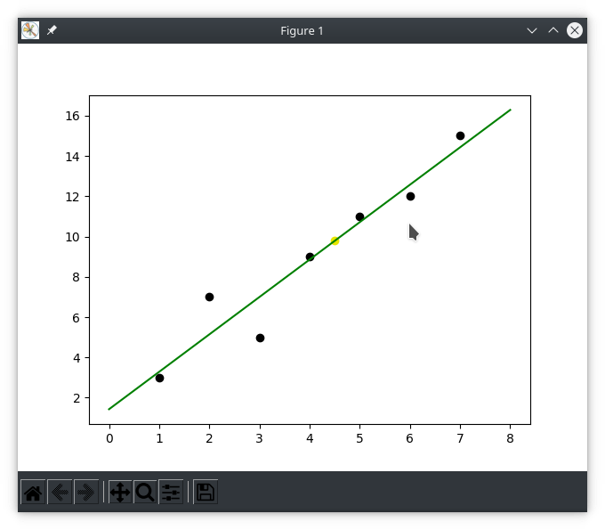

Install required dependencies for matplotlib GUI frontend and all pip other packages for this project

```bash
sudo apt install python3-tk
python3.9 -m pip install -r requirements.txt
```

Given a set of tuple `(X,Y)` data points as `[(X, Y), .., (X, Y)]`, determine the 
best fitting line plot, and then apply this projection to predict the dependent `Y` 
value using an independent `GIVEN_X` value. 

```bash
python3.9 linear-regression.py -h
usage: linear-regression.py [-h] [--silent] [--file [FILE_PATH]] [GIVEN_X] [X,Y ...]

Find most fitting line plot for given data points and predict value given some X

positional arguments:
  GIVEN_X               Value for X for prediction using linear regression
                            (default: '4.5')
                                
  X,Y                   A list of data points separated by spaces as: x,y x,y x,y ...
                            (default: '[(1, 3), (2, 7), (3, 5), (4, 9), (5, 11), (6, 12), (7, 15)]')
                                

optional arguments:
  -h, --help            show this help message and exit
  --silent              When this flag is set, line plot visualization will not be shown
                            (default: 'False')
                                
  --file [FILE_PATH], -f [FILE_PATH]
                        Optionally provide file for data to be read from. Each point must be on it's own line with format x,y 
```

By default, the following linear regression is calculated and displayed 
```bash
python3.9 linear-regression.py


Finding fitting line plot for given data [(1, 3), (2, 7), (3, 5), (4, 9), (5, 11), (6, 12), (7, 15)]
points_avg: (4.0, 8.857142857142858)
variance: (28.0, 104.85714285714286)
sigma: (2.160246899469287, 4.180453381654971)
covariance: 8.666666666666666
correlation: 0.9596775116832306
Our line Y = BX + A must pass through the point (4.0, 8.857142857142858)
Y = (1.8571428571428565)X + 1.4285714285714315
For X = 4.5, Y is predicted to be 9.785714285714285
```


