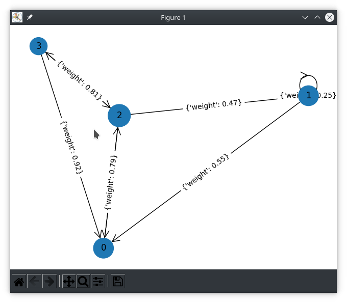

Install required dependencies for matplotlib GUI frontend and all pip other packages for this project

```bash
sudo apt install python3-tk
python3.9 -m pip install -r requirements.txt
```

CLI tool to determine most probably path of Hidden Markov Model given an observation sequence of emissions.

Given an observation sequence of emissions, find the most probable path of traversal for a Hidden Markov Model. 
Since this is just an example of HMM, a graph can be automatically generated by specifying only the node count. 
Edges and weights connecting the nodes will be randomly assigned.
If required, an input graph can be provided through the JSON configuration option.
See provided examples of JSON input files for more detail on options available.

```bash
python3.9 markov-model.py -h


usage: markov-model.py [-h] [--nodes [GRAPH_NODE_COUNT]] [--edges [GRAPH_EDGE_COUNT]] [--show-all] [--interactive] [--silent]
              [--file [FILE_PATH]]
              [OBSERVATION_SEQUENCE ...]

Calculates most probable path of HMM given an observation sequence

positional arguments:
  OBSERVATION_SEQUENCE  An observation sequence to calculate the most probable path
                            (default: '['A', 'B', 'D', 'C']')
                                

optional arguments:
  -h, --help            show this help message and exit
  --nodes [GRAPH_NODE_COUNT], -n [GRAPH_NODE_COUNT]
                        The total number of node states in the HMM graph
                            (default: '4')
                                
  --edges [GRAPH_EDGE_COUNT], -e [GRAPH_EDGE_COUNT]
                        The total number of edges in the HMM graph
                            (default: '8')
                                
  --show-all            When this flag is set, all path probabilities and their calculations will be output
                            (default: 'False')
                                
  --interactive         Allow taking input to update matrices with triple (row, col, value)
                            (default: 'False')
                                
  --silent              When this flag is set, final graph will not be shown
                            (default: 'False')
                                
  --file [FILE_PATH], -f [FILE_PATH]
                        Optionally provide file for data to be read from. Each point must be on it's own line with format x,y 
```

Running HMM with a graph using 4 nodes, 8 edges, and random transition / emission matrices
Sometimes there can be a sequence with no possible path due to a constrained transition matrix
Sometimes there can be a sequence with no possible path due to a limited emission matrix

```bash
python3.9 markov-model.py --nodes 4 --edges 8 --show-all A B D C G --silent


1->3: 0.89
1->0: 0.6
3->3: 0.81
3->1: 0.29
0->2: 0.67
0->1: 0.89
2->0: 0.12
2->1: 0.41
Calculating (0, 2, 1, 0, 2): (0.98 * 0.67) * (0.74 * 0.41) * (0.22 * 0.60) * (0.22 * 0.67) * 0.36 = 0.001395
Calculating (0, 2, 1, 3, 3): (0.98 * 0.67) * (0.74 * 0.41) * (0.22 * 0.89) * (0.11 * 0.81) * 0.52 = 0.001807
Finding most probable path for given observation sequence: ['A', 'B', 'D', 'C', 'G']
        Total nodes in graph: 4
        Total edges in graph: 8
        Number of sequences: 5
        Interactive mode: False
        Emitting nodes: {'A': [0, 2], 'B': [1, 2], 'C': [0, 2, 3], 'D': [1, 2], 'G': [0, 2, 3]}
Transition matrix: 
[[0.   0.89 0.67 0.  ]
 [0.6  0.   0.   0.89]
 [0.12 0.41 0.   0.  ]
 [0.   0.29 0.   0.81]]
Emission matrix: 
[[ 0.98  0.    0.22  0.    0.11]
 [ 0.    0.1  -0.    0.22  0.  ]
 [ 0.67  0.74  0.46  0.62  0.36]
 [-0.    0.    0.11  0.    0.52]]
Final paths sorted by probability:
(0, 2, 1, 3, 3) has probability:         0.001807
(0, 2, 1, 0, 2) has probability:         0.001395
```

By default, a random Hidden Markov Model and visualization will be generated and the sequence `[A, B, D, C]` will be used.

```bash
python3.9 markov-model.py


Finding most probable path for given observation sequence: ['A', 'B', 'D', 'C']
        Total nodes in graph: 4
        Total edges in graph: 8
        Number of sequences: 4
        Interactive mode: False
        Emitting nodes: {'A': [0, 2, 3], 'B': [1, 2, 3], 'C': [0, 3], 'D': [1, 2]}
Transition matrix:
[[0.   0.   0.31 0.  ]
 [0.55 0.25 0.   0.  ]
 [0.79 0.47 0.   0.12]
 [0.92 0.   0.81 0.  ]]
Emission matrix:
[[0.45 0.   0.4  0.  ]
 [0.   0.89 0.   0.51]
 [0.12 0.24 0.   0.78]
 [0.08 0.42 0.96 0.  ]]
(0, 2, 1, 0) has the highest probability of 0.00176553432
```



