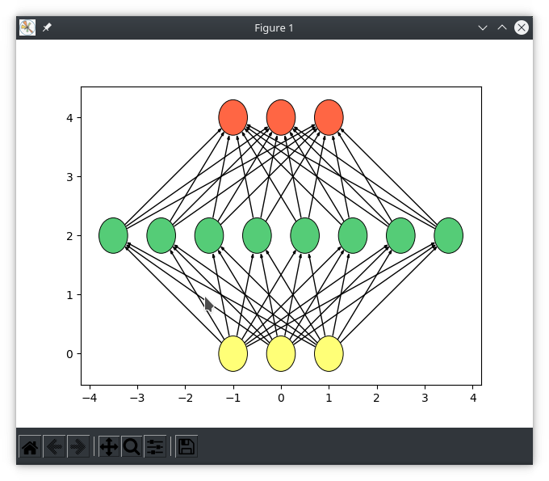

Install required dependencies for matplotlib GUI frontend and all pip other packages for this project

```bash
sudo apt install python3-tk
python3.9 -m pip install -r requirements.txt
```

Neural network implementation using Python CLI to dynamically generate a resizable network
 and then run a given number of learning cycles on the provided data set. 
As an example, the IRIS dataset is used to classify flower types using petal measurements.
Input layer perceptron count can be adjusted with `INPUTS` positional parameter
Hidden layer perceptron count can be adjusted with `PERCEPTRONS` positional parameter
Output layer perceptron count can be adjusted with `OUTPUTS` positional parameter
Hidden layers can be added or removed using`--hidden-layers` option setting
Node bias can be initialized randomly or with provided data.
Perceptron edge weight bias can be initialized randomly or with provided data.
Threshold for perceptron fire can be initialized randomly or with provided data.

Setup instructions and output of `neural-network.py -h`- 
```bash
python3.9 neural-network.py -h


usage: neural-network.py [-h] [--hidden-layers [HIDDEN_LAYERS]] [--cycles [CYCLES]] [--learn-rate [LEARNING_RATE]]
              [--bias [INITIAL_BIAS]] [--weight [INITIAL_EDGE_WEIGHTS]] [--error-threshold [ERROR_THRESHOLD]]
              [--fire-threshold [FIRE_THRESHOLD]] [--spacing [LAYER_SPACING]] [--horizontal] [--silent] [--verbose]
              [--file [file_path]]
              [INPUTS] [PERCEPTRONS] [OUTPUTS]

Neural network implementation

positional arguments:
  INPUTS                Number of inputs for the neural network
                            (default: '3')
                                
  PERCEPTRONS           Number of perceptrons in each hidden layer
                            (default: '8')
                                
  OUTPUTS               Number of outputs for the neural network
                            (default: '3')
                                

optional arguments:
  -h, --help            show this help message and exit
  --hidden-layers [HIDDEN_LAYERS], -l [HIDDEN_LAYERS]
                        Number of hidden layers
                            (default: '1')
                                
  --cycles [CYCLES], -c [CYCLES]
                        Number of cycles to run through the network
                            (default: '3')
                                
  --learn-rate [LEARNING_RATE]
                        Learning rate to use for the network.
                            Must be within range of 0.0 < rate <= 1.0
                            (default: '0.25')
                                
  --bias [INITIAL_BIAS], -b [INITIAL_BIAS]
                        The initial bias to use for perceptrons within the network.
                            Must be within range of -1.0 <= bias <= 1.0
                            If value is unset, bias will be initialized randomly
                                 
  --weight [INITIAL_EDGE_WEIGHTS], -w [INITIAL_EDGE_WEIGHTS]
                        The initial edge weight to use for node connections in the network
                            If value is unset, edge weights will be initialized randomly
                                
  --error-threshold [ERROR_THRESHOLD], --error [ERROR_THRESHOLD]
                        The acceptable error threshold to use for training the network.
                            (default: '0.5')
                                
  --fire-threshold [FIRE_THRESHOLD], --fire [FIRE_THRESHOLD]
                        The fire threshold for perceptrons in the network.
                            If a perceptron's cumulative inputs reach this value, the perceptron fires
                            (default: '0.25')
                            
  --spacing [LAYER_SPACING]
                        Distance between origin of network layers within visualization
                            (default: '2.0')
                                
  --horizontal, --flip  The network visualization will flow left-to-right
                            (default: 'False')
                                
  --silent              Do not show the network visualization, only print output to console
                            (default: 'False')
                                
  --verbose, -v         When this flag is set, error rate and change in weight will be output for each calculation
                            (default: 'False')
                                
  --file [file_path], -f [file_path]
                        Optionally provide a json file to configure any option available through the cli
                            json keys match --long version of each option, where --long-split option key is "long_split" in json
```

Input and output layers are sized by the length of a single input sequence and the number of possible label classifications.
If the length of an input sequence does not match the number of input nodes requested, a warning will show.
If the length of possible label classifications does not match the number of output nodes requested, a warning will show.
In both cases, the program corrects the node count to match the input data / labels, and not the requested node count.

The total number of output labels provided must match the total number of the number of input sequences.

Running NN program uses IRIS data set by default. 
Warnings will be shown if input and output node count is changed without providing new input.
```bash
python3.9 neural-network.py --file input.json --silent


Warning: Input sequences each contain 3 entries but 5 input nodes were requested.
        Using 3 input nodes instead of 5
Warning: Output labels contain 3 possible classifications but 8 output were nodes requested.
        Using 3 output nodes instead of 8
Creating a single layer neural network: 
        Total input nodes: 3
        Number of perceptrons in each hidden layer: 8
        Total output nodes: 3
        Number of hidden layers: 3
        Fire threshold: 0.25
        Error threshold: 0.5
        Learn rate: 0.25
        Initial bias: Random
        Initial edge weights: Random
Network visualization settings: 
        Graph visualization is enabled: False
        Graph visualization is horizontal: True
        Graph visualization is vertical: False
        Graph visualization layer spacing: 2.0
        Test data input count: 150
inputs layer: [0, 1, 2]
hidden layer: [[3, 4, 5, 6, 7, 8, 9, 10], [11, 12, 13, 14, 15, 16, 17, 18], [19, 20, 21, 22, 23, 24, 25, 26]]
outputs layer: [27, 28, 29]
[Cycle 1]       Accuracy: 92.6667%      [139 / 11]
[Cycle 2]       Accuracy: 95.3333%      [286 / 14]
[Cycle 3]       Accuracy: 96.2222%      [433 / 17]
[Cycle 4]       Accuracy: 96.6667%      [580 / 20]
[Cycle 5]       Accuracy: 96.9333%      [727 / 23]
[Cycle 6]       Accuracy: 97.1111%      [874 / 26]
[Cycle 7]       Accuracy: 97.2381%      [1021 / 29]
[Cycle 8]       Accuracy: 97.3333%      [1168 / 32]
[Cycle 9]       Accuracy: 97.4074%      [1315 / 35]
[Cycle 10]      Accuracy: 97.4667%      [1462 / 38]

Correct: 1462    Wrong: 38       Total: 1500
Cycle 1 accuracy: 92.6667%      Cycle 10 accuracy: 97.4667%
4.8% change over 10 cycles      0.48% average change per cycle
```


Running NN program with garbage data in `input-test.json` to test resizing of input / output layers.
A single input sequence is `[0, 1, 0, 1, 1, 1]` which is length of 6, so 6 input nodes are created.
Within the output labels, there are 8 unique labels in the set, so 8 output nodes are created.
The length a single label must match the number of output nodes.
For 8 output nodes, the labels `[1, 0, 0, 0, 0, 0, 0, 0]` and `[0, 1, 0, 0, 0, 0, 0, 0]` are valid.

```bash
python3.9 neural-network.py --file ./input-test.json --silent


Warning: Output labels contain 8 possible classifications but 10 output were nodes requested.
        Using 8 output nodes instead of 10
Creating a single layer neural network: 
        Total input nodes: 6
        Number of perceptrons in each hidden layer: 8
        Total output nodes: 8
        Number of hidden layers: 3
        Fire threshold: 0.25
        Error threshold: 0.5
        Learn rate: 0.25
        Initial bias: Random
        Initial edge weights: Random
Network visualization settings: 
        Graph visualization is enabled: False
        Graph visualization is horizontal: True
        Graph visualization is vertical: False
        Graph visualization layer spacing: 2.0
        Test data input count: 14
inputs layer: [0, 1, 2, 3, 4, 5]
hidden layer: [[6, 7, 8, 9, 10, 11, 12, 13], [14, 15, 16, 17, 18, 19, 20, 21], [22, 23, 24, 25, 26, 27, 28, 29]]
outputs layer: [30, 31, 32, 33, 34, 35, 36, 37]
[Cycle 1]       Accuracy: 35.7143%      [5 / 9]
[Cycle 2]       Accuracy: 39.2857%      [11 / 17]
[Cycle 3]       Accuracy: 40.4762%      [17 / 25]
[Cycle 4]       Accuracy: 41.0714%      [23 / 33]
[Cycle 5]       Accuracy: 41.4286%      [29 / 41]
[Cycle 6]       Accuracy: 41.6667%      [35 / 49]
[Cycle 7]       Accuracy: 41.8367%      [41 / 57]
[Cycle 8]       Accuracy: 41.9643%      [47 / 65]
[Cycle 9]       Accuracy: 42.0635%      [53 / 73]
[Cycle 10]      Accuracy: 42.1429%      [59 / 81]

Correct: 59      Wrong: 81       Total: 140
Cycle 1 accuracy: 35.7143%      Cycle 10 accuracy: 42.1429%
6.4286% change over 10 cycles   0.6429% average change per cycle
```

By default, the following network and visualization will be generated

```bash
python3.9 neural-network.py
# Output removed for GUI example
```

